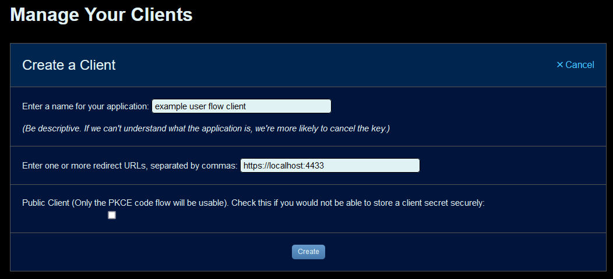

User mode
=========

Client modes
------------

The fflogsapi client can be used in two different modes - ``client`` mode and ``user`` mode.
The default mode of the client is ``client`` mode, which uses the public API. If you want to access
private information, however, you must use the client in ``user`` mode.

Examples of such information can be your own reports or character information if you have set visibility to private.

Setting up your API client for user mode
----------------------------------------

To use user mode, you must specify ``https://localhost:4433`` as one of your redirect URLs in your API
client on FF Logs.

When instantiating the client, provide the ``mode='user'`` kwarg:

.. code-block:: python

    client = FFLogsClient(CLIENT_ID, CLIENT_SECRET, mode='user')

Differences to client mode
--------------------------

In user mode, the fflogsapi client will popup a browser window to allow the user to login and provide access
once the first query to the API is made.

.. note::
    The client will generate a self-signed certificate to serve the redirect.
    Your browser will likely produce a warning about this, although it is safe to ignore.

Custom authentication flows
---------------------------

If you wish to handle the user authentication flow yourself, you can still use the API client in
user mode by calling `set_auth_response` to manually set the auth response. This must be done after
instantiation, but before the first API query is made.

.. code-block:: python

    # Your implementation of the user authentication flow here
    ...

    client = FFLogsClient(CLIENT_ID, CLIENT_SECRET, mode='user')
    client.set_auth_response(response)

    # Start using the client
    ...
